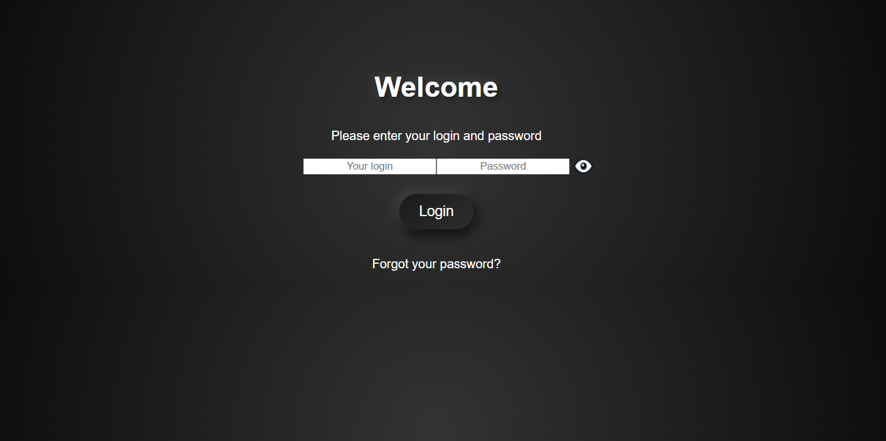

# 🔐 Login Form with Show/Hide Password Feature

This project is a **modern login form** featuring a sleek **3D Button design** and a **show/hide password toggle**. Built with **HTML, CSS, and JavaScript**, it offers an intuitive user experience, allowing users to easily toggle the visibility of their password input.

## ✨ Features

- **Responsive Design**:Ensures optimal viewing on various devices and screen sizes
- **Password Visibility Toggle**:Click the eye icon to show or hide the password
- **Modern 3D UI**:Utilizes CSS for a contemporary three-dimensional appearance
- **Lightweight and Efficient**:Designed for performance without unnecessary bloat

## 🛠 Technologies Used

- **HTML5** Provides the structure of the for
- **CSS3** Offers styling with advanced effect
- **JavaScript (ES6)** Implements the show/hide password functionalit

## 📸 Preview



## 🚀 Installation & Usage

1. **Clone the Repository**:   ```bash
   git clone https://github.com/Nissmoline/login_From.git
  ``
2. **Navigate to the Project Directory**:   ```bash
   cd login_From
  ``
3. **Open the HTML File**:   ```bash
   open LoginFrom.html
  ``
   *Alternatively, open `LoginFrom.html` directly in your preferred web browser.*

## 📝 Future Enhancements

- **Form Validatio**: Implement client-side and server-side validation to enhance security and user feedck.
- **Dark/Light Mode Toggl**: Provide users with the option to switch between dark and light thes.
- **Enhanced Animation**: Incorporate smoother transitions and animations for a more engaging user experice.

---
